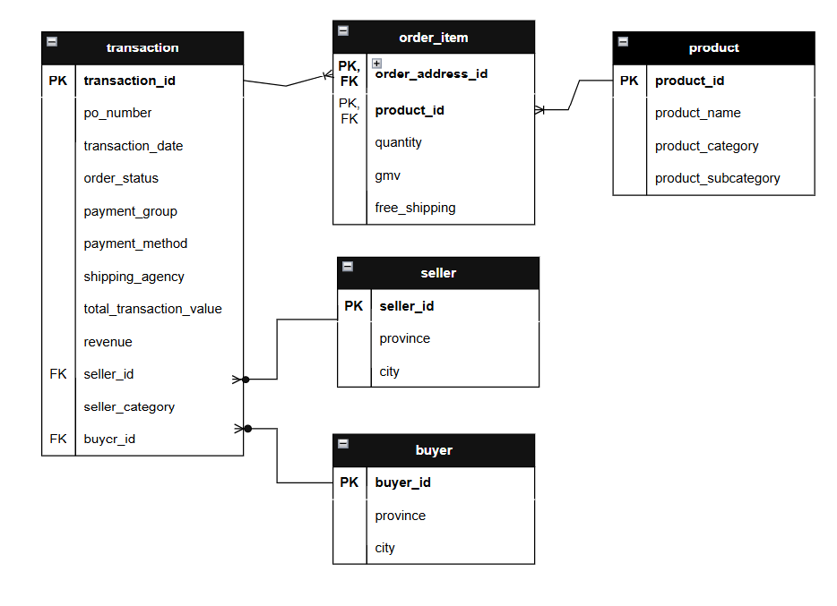
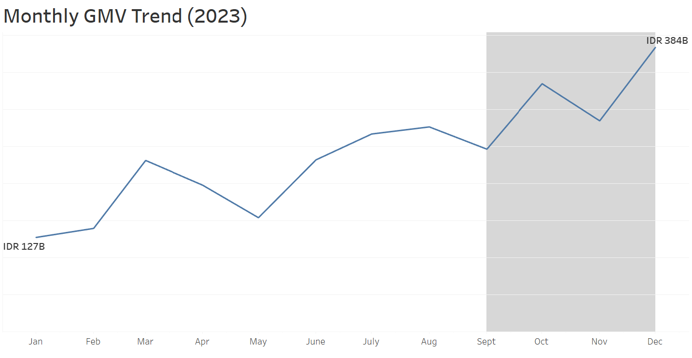
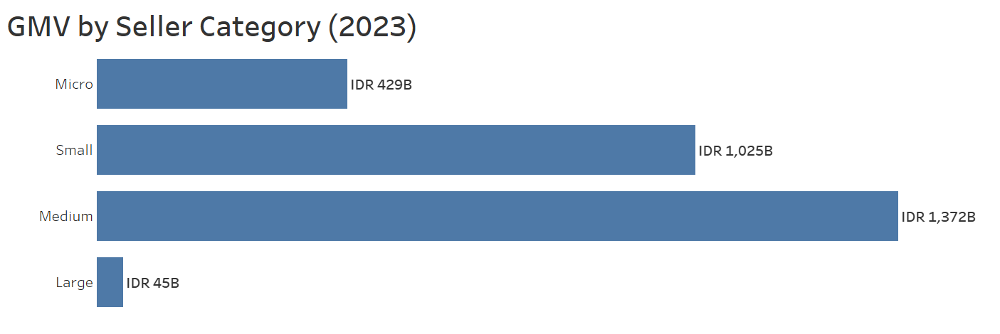
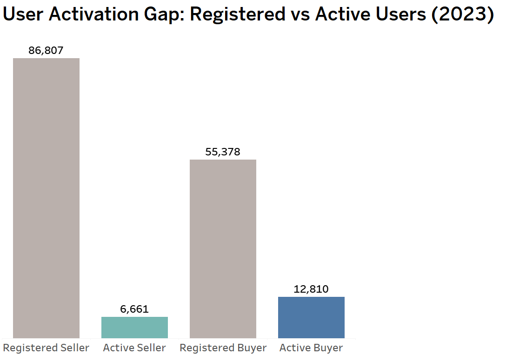

# PaDi UMKM Marketplace Performance Analysis: Seller–Buyer Activation Insights for Marketing Strategy

## Background of the project
PaDi UMKM is a digital platform developed by Telkom Indonesia to connect micro, small, and medium enterprises (MSMEs) with buyers, primarily state-owned enterprises (SOEs/BUMN). It was launched in 2020 during the COVID-19 pandemic to support MSME sustainability and recovery.

While most buyers are SOEs, the platform also includes a smaller number of private companies, further expanding market access for MSMEs. Beyond its commercial function, PaDi UMKM aims to act as a catalyst for MSME growth by enabling access to larger and more stable markets.

This project simulates a business request from the Marketing Team to evaluate the company’s performance trends, particularly seller and buyer distribution; to support data-driven campaign strategies for user acquisition and engagement. In addition, the analysis also examines whether current platform activity aligns with PaDi’s broader mission of empowering MSME sellers and promoting sustainable marketplace participation.

To support data-driven decision-making, this project focuses on answering the following business questions:

•	Does the current distribution of active sellers align with PaDi’s mission to empower MSME participation across the platform?

•	Why is there a significant gap between registered users and active transacting users on both the seller and buyer sides?

•	Which seller, buyer, and transaction segments should be prioritized for future marketing campaign strategies?

•	How do seller categories, payment options, and product segments contribute to GMV, transaction volume, and platform revenue?

The analysis is based on platform data spanning **January to December 2023**, providing a one-year snapshot of transaction activity, seller participation, and buyer engagement.

## Data Structure Overview 
The dataset is organized into five relational tables: transaction, order_item, seller, buyer, and product. The transaction table acts as the main fact table with **159,133 records**, while the order_item table contains **474,268 line-item records**, reflecting the product-level details of each transaction. The remaining tables serve as dimension tables, enriching the analysis with seller, buyer, and product information.

Since a single transaction may include multiple products, the order_item table is modeled at the line-item level. Therefore, a composite key (transaction_id, product_id) is used to uniquely identify each record.

Prior to analysis, SQL was used to conduct data quality checks and dataset familiarization, including validation of unique keys, missing values, table relationships, duplicate records, and transaction-level granularity.

## Executive Summary

All monetary values are shown in Indonesian Rupiah (IDR)

In 2023, PaDi UMKM generated approximately IDR 2.87 trillion in GMV, while platform revenue reached IDR 24.28 billion, resulting in an average take rate of 0.73%.
Q4 recorded the strongest performance, contributing approximately IDR 1 trillion, which is consistent with the year-end spending behaviour commonly observed among SOEs under a “use it or lose it” budget allocation mindset.

Despite strong marketplace value generation, the analysis revealed a significant gap between registered and active users, particularly on the seller side. Of the 86,807 registered sellers, only 6,661 completed at least one transaction in 2023, resulting in a seller activation rate of only 7.7%. This indicates a substantial opportunity for targeted activation campaigns and seller re-engagement initiatives to improve marketplace participation.

## Limitations & Assumptions
The analysis is subject to several data limitations and assumptions that should be considered when interpreting the findings:

•	 **Limited time coverage**: The dataset covers only one calendar year (2023), which limits the ability to perform historical comparisons and year-over-year analysis. As a result, long-term business trends, growth patterns, and recurring seasonality cannot be fully evaluated.

•	**Incomplete buyer segmentation**: The dataset contains limited information on buyer categories or demographic attributes, restricting deeper analysis of buyer profiles and campaign targeting opportunities. 

•	**Location mismatch between users**: Seller and buyer province data are stored separately and may not always align within a single transaction, which limits direct comparison of regional activity between both user groups in a unified view.

•	**Activity-based assumptions**: Registered users are classified as “active” based on the presence of at least one completed transaction during the analysis period. This definition may not fully reflect broader engagement behaviours such as browsing or listing activity.

•	**active seller and buyer** = seller and buyer with at least one transaction

## Insights Deep Dive

### Market place performance

Small and Medium sellers drove the majority of total GMV. contributing approximately 84% of total GMV in 2023. Among them, Medium sellers alone generated IDR 1.37T, representing nearly 48% of total GMV, making them the largest contributor.

In contrast, Large sellers contributed only around 1.6%, suggesting that PaDi’s marketplace activity is strongly aligned with its mission of empowering MSMEs.

Interactive chart version: in Tableau Dashboard

### Key findings
• **Product Category**: Although the marketplace contains 50 listed product categories, approximately 71% of total GMV was generated by only the top 10 categories, indicating a high concentration of transaction value within a limited number of segments. Most of these top-performing categories are concentrated in non-agricultural sectors, including electronics, construction and renovation services, industrial machinery, workshop tools, event organizer services, and catering.

•	**Payment Option**: Approximately 93% of total GMV was generated through TOP (Term of Payment) transactions, reflecting the common procurement practices of state-owned enterprises (SOEs).

•	**Shipping Agency**: Self-delivery accounts for approximately 89% of total transactions, making it the dominant fulfilment method on the platform. Further breakdown by product category reveals that 72% of self-delivered orders are concentrated in office stationery, workshop tools, electronics, food and beverages, and souvenirs & merchandise. This suggests that self-delivery is primarily associated with locally sourced, repeat-purchase items that support routine business procurement needs.

###

The chart highlights a significant activation gap across both buyers and sellers. Seller activation is particularly low, with only 6,661 out of 86,807 registered sellers completing at least one transaction in 2023, representing an activation rate of just 7.7%. In comparison, buyer activation stands at 23.1%, indicating relatively stronger demand-side participation. This suggests that future marketing and platform strategies should prioritize seller activation and re-engagement initiatives.
### Geographical analysis
Geographic analysis shows that marketplace activity is highly concentrated in Indonesia’s major economic regions. Approximately 79% of buyers and 76% of sellers, across both registered and active users, are concentrated in Java Region. This suggests that both demand and supply are predominantly centred in provinces with stronger socioeconomic development and more mature business ecosystems compared with other regions.
This regional concentration is consistent with the marketplace performance analysis, where GMV is primarily driven by industrial, construction, and service-related categories commonly associated with urban and economically developed areas.

## Recommendations
Make it clear that your recommendations come from your insights, by referencing the numbers from your findings
•	Develop targeted seller activation and re-engagement campaigns, particularly for newly registered sellers who have not completed their first transaction. This may include onboarding guidance, promotional incentives, first-order discounts, and personalized seller support programs.
•	Improve the product listing process by making category selection simpler and easier for sellers, so more registered users can become active sellers.
•	Prioritize campaign efforts in Java and other economically developed regions, where both buyer demand and seller participation are already concentrated, while designing expansion strategies for underrepresented regions with future growth potent.
•	Since 71% of GMV is concentrated in the top 10 product categories, future growth initiatives should focus on expanding underrepresented product segments and regional markets to reduce concentration risk and diversify marketplace demand.

